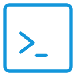

#  Terminal Tools

## Preview

## About

<table><td style="padding:0 8px;" bgcolor="#007ACC"></td></table>
	
	remember the active file then can run it when you are editting other files;
<table><td style="padding:0 8px;" bgcolor="#007ACC">CD</td></table>

	cd to the active file's path
<table><td style="padding:0 8px;" bgcolor="#007ACC">npm</td></table>

	select provided or custom directives to run in the terminal. Like installing some frequently used packages
<table><td style="padding:0 8px;" bgcolor="#007ACC">Clear</td></table>

	clear the active terminal
<table><td style="padding:0 8px;" bgcolor="#007ACC">Rerun</td></table>

	restart the active terminal then run the active js/ts file
<table><td style="padding:0 8px;" bgcolor="#007ACC">Run</td></table>

	run the active js/ts file
<table><td style="padding:0 8px;" bgcolor="#007ACC">Stop</td></table>

	restart the active terminal to destroy the running task