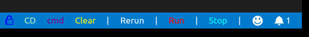

# Terminal Tools
## Preview
	
## About
- lock icon
	+ remember the active file then can run it when you are editting other files;
- CD
	+ cd to the active file's path
- npm
	+ provide some directives to select to run in the terminal. Like installing some frequently used packages
- Clear
	+ clear the active terminal
- Rerun
	+ restart the active terminal then run the active js/ts file
- Run
	+ run the active js/ts file
- Stop
	+ restart the active terminal intend to destroy the running task

## Install vsce
      npm install -g vsce
## Packaging extension
      vsce package
## Install extension
      code --install-extension terminal-tools